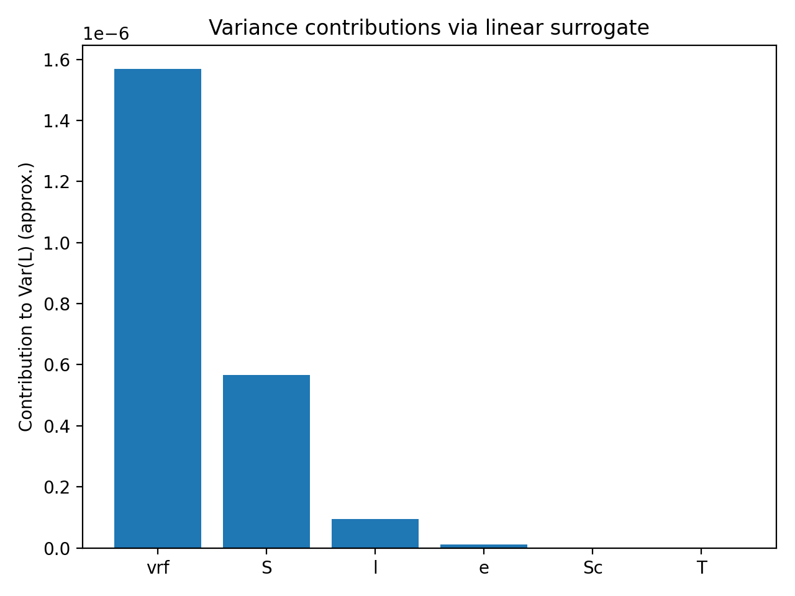
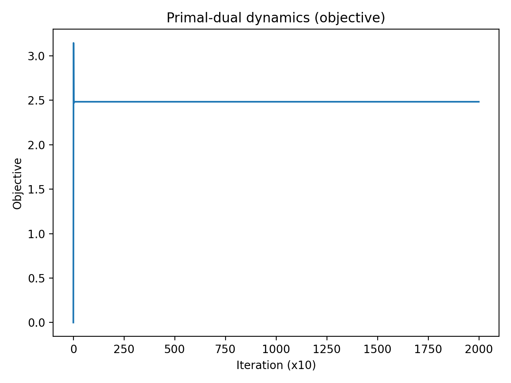

# Minimum-Cost Variance Reduction in Toroidal Inductor Manufacturing

> Surrogate Modeling · Convex Optimization · Generalized Nash Equilibrium  
> *OGL Course Project — Southeast University (Exchange, 2025)*

---

## Overview

In toroidal inductor manufacturing, small dispersions in geometric and material parameters propagate into inductance variability, driving scrap and rework. This project formulates and solves a **minimum-cost process-tightening problem**: *where should manufacturing effort be concentrated to halve the standard deviation of inductance at lowest cost?*

The dataset contains **200 manufactured coils** with 6 measured inputs and the resulting inductance $L$.

### Three-layer analysis

| Layer | What we do |
|---|---|
| **Surrogate modeling** | Compare a data-driven OLS regression vs. a physics-inspired magnetic-circuit model |
| **Convex optimization** | Solve the variance-constrained tightening problem via Lagrangian duality + bisection |
| **Game theory** | Re-interpret the same problem as a Generalized Nash Equilibrium; verify convergence via primal-dual gradient play |

---

## Problem Setup

**Inputs** $x = [S, l, e, \nu_r, T, S_c]^\top$:

| Variable | Description |
|---|---|
| $S$ | Core cross-section (m²) |
| $l$ | Mean magnetic path length (m) |
| $e$ | Air-gap (m) |
| $\nu_r$ | Reluctivity proxy (material) |
| $T$ | Temperature (°C) |
| $S_c$ | Wire cross-section (m²) |
| $L$ | **Measured inductance** (H) — target variable |

---

## Methods

### 1. Surrogate Models

Two models are benchmarked on a 75/25 train/test split:

**OLS linear surrogate:**
$$\hat{L}_{\text{lin}}(x) = \beta_0 + \beta^\top x$$

**Physics-inspired model** (magnetic circuit — reluctance $\propto (l\nu_r + e)/S$):
$$\hat{L}_{\text{phys}}(x) = k \cdot \frac{S}{l\nu_r + e}$$

The physics model fits a single scalar $k$ by least squares and achieves comparable accuracy to OLS, confirming the dataset is broadly consistent with magnetic-circuit structure.

| Model | $R^2$ | RMSE (H) |
|---|---|---|
| OLS | 0.929 | $4.16 \times 10^{-4}$ |
| Physics | 0.931 | $4.09 \times 10^{-4}$ |

---

### 2. Variance-Constrained Process Tightening

Under a linear-surrogate variance-propagation approximation, if input $j$ has its standard deviation reduced by factor $r_j \in [r_{\min}, 1]$:

$$\text{Var}(L) \approx \sigma_\varepsilon^2 + \sum_{j=1}^6 a_j r_j^2, \qquad a_j := \beta_j^2 \cdot \text{Var}(x_j)$$

The cost of tightening is $c_j(1 - r_j)^2$ (larger effort for larger reduction). We solve:

$$\min_{r \in [r_{\min},1]^6} \sum_j c_j(1-r_j)^2 \quad \text{s.t.} \quad \sigma_\varepsilon^2 + \sum_j a_j r_j^2 \leq \text{Var}_{\text{target}}$$

**Solver:** closed-form primal update via KKT stationarity + 1D bisection on the dual variable $\lambda$.

$$r_j(\lambda) = \Pi_{[r_{\min},1]}\!\left(\frac{c_j}{c_j + \lambda a_j}\right)$$

**Results** (halving Std(L), cost vector $(c_S, c_l, c_e, c_{\nu_r}, c_T, c_{S_c}) = (2, 1.5, 1, 5, 0.1, 1)$):

| Strategy | Cost | vs. Optimal |
|---|---|---|
| **Optimal (convex)** | 2.44 | — |
| Uniform tightening | 3.25 | +33% |
| Top-2 only ($\nu_r$, $S$) | 2.55 | +5% |

The optimal policy concentrates on $\nu_r$ (−59%) and $S$ (−55%), which are both the dominant variance drivers and the most cost-effective to tighten.

---

### 3. Generalized Nash Equilibrium View

Each $r_j$ is interpreted as controlled by an independent process owner (machining, supplier, winding, etc.). Each minimizes its local cost $c_j(1-r_j)^2$ subject to a **shared quality constraint** — a Generalized Nash Equilibrium (GNE) with shared constraint.

The variational GNE coincides with the KKT solution of the centralized convex program. It is computed via **primal-dual gradient play**:

$$r_j^{t+1} = \Pi_{[r_{\min},1]}\!\Big(r_j^t - \alpha\big(2c_j(r_j^t-1) + 2\lambda^t a_j r_j^t\big)\Big)$$
$$\lambda^{t+1} = \Big[\lambda^t + \beta\Big(\sigma_\varepsilon^2 + \sum_j a_j(r_j^{t+1})^2 - \text{Var}_{\text{target}}\Big)\Big]_+$$

The primal-dual dynamics converge to the same optimum as the centralized solver.

---

## Results

<p align="center">
  
  &nbsp;
  
</p>

*Left: variance contributions vrf, S and l dominate. Right: primal-dual objective converges to the convex optimum.*

---

## Repository Structure

```
ogl-manufacturing-optimization/
├── results/
│   ├── fig_contrib.png               # Variance contributions by input
│   └── fig_convergence.png           # Primal-dual convergence curve
├── report/
│   └── ogl_project_report_final.tex  # Full IEEE-format report (LaTeX)
├── come_MUNTU-QUITUBA_ogl_project_code.py
├── dataset.csv                        # Manufacturing dataset (200 coils)
└── README.md
```

---

## Usage

```bash
pip install numpy pandas scikit-learn matplotlib
python come_MUNTU-QUITUBA_ogl_project_code.py
```

**Output:**
- Console: OLS/physics R² and RMSE, optimal tightening factors $r^*$, primal-dual solution
- `results/fig_contrib.png`: bar chart of variance contributions $a_j$
- `results/fig_convergence.png`: primal-dual objective convergence curve

---

## Key Results

- Both surrogates achieve $R^2 \approx 0.93$ — the physics model with **1 parameter** matches OLS with **6**
- Dominant variance drivers: **$\nu_r$ (material reluctivity)** and **$S$ (core cross-section)**
- Optimal tightening achieves **33% cost reduction** vs. uniform tightening while meeting the same variance target
- Primal-dual gradient play converges to the centralized optimum, validating the GNE interpretation

---

## References

- Boyd & Vandenberghe, *Convex Optimization*, Cambridge University Press, 2004
- Facchinei & Kanzow, "Generalized Nash equilibrium problems," *4OR*, 2007
- S. Yang, OGL2025 course slides, Southeast University, 2025
